# The Changing Shape of Capital Bikeshare Demand

A descriptive comparison of demand composition and hourly usage patterns in Washington, D.C., 2011–2012.

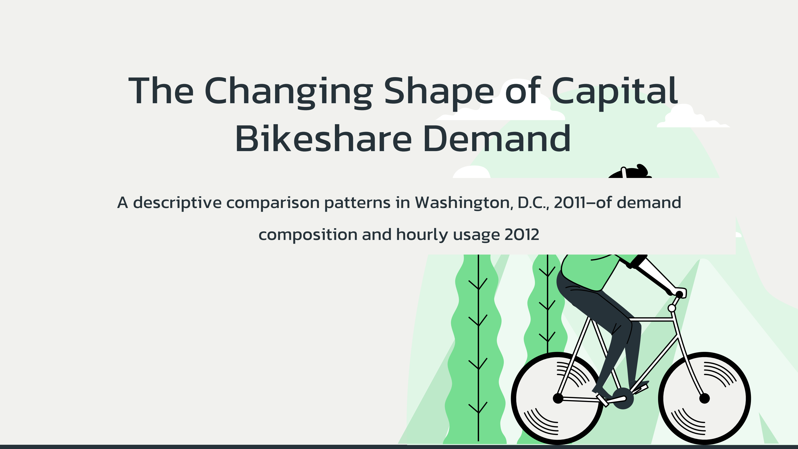

> 📓 **[View the Analysis Notebook →](notebook.ipynb)**

## Overview

### Background

Bike-sharing is a shared transportation service that provides bicycles for short-term use at low cost. Such systems can support flexible and accessible urban mobility while offering an environmentally friendly and health-promoting mode of transportation.

Capital Bikeshare in Washington, D.C., serves two primary user groups: casual users, who use the service without registered membership, and registered users, who are enrolled members of the system. Users can rent bicycles from a network of automated stations and return them to any available dock within the network.

### Business Problem

Capital Bikeshare experienced substantial growth in rental activity between 2011 and 2012. However, growth in total rental activity alone does not reveal how the composition and timing of bike-sharing demand changed. An increase in rentals may be concentrated among casual users, registered users, or both, while aggregate totals can obscure shifts in the relative contribution of each group. Aggregate growth can also conceal changes in when demand occurs, as hourly rental patterns may differ between working and non-working days and may change as overall usage expands.

From a managerial perspective, these distinctions matter. A system whose growth is increasingly concentrated in rentals by registered users may warrant different user-focused strategies from one in which rentals by casual and registered users grow more evenly. Likewise, changes in hourly demand patterns may have implications for service planning and the timing of operational resources.

The central challenge is therefore to determine how the composition and hourly patterns of bike-sharing demand changed between 2011 and 2012, providing a clearer basis for operational decision-making.

### Outcome

The analysis will provide management with evidence to:

- Refine customer strategy by assessing how rental demand is distributed between casual and registered users and how that composition changed over time.
- Improve operational planning by identifying hourly demand patterns across working and non-working days and across user types.
- Guide the timing of resource allocation for bicycle redistribution, staffing, and related operational needs during periods of higher demand.
- Support longer-term planning by establishing a clearer picture of how the scale and timing of bike-sharing demand evolved as the system grew.

## Analytical Questions

To address the business problem, the analysis was guided by two analytical questions:

1. How did the volume and composition of bike-sharing demand between casual and registered users change from 2011 to 2012?
2. How did hourly bike-sharing demand patterns change from 2011 to 2012 overall, between casual and registered users, and between working and non-working days?

## Dataset

This project uses the Bike Sharing dataset originally distributed through the [UCI Machine Learning Repository](https://doi.org/10.24432/C5W894), containing aggregated rental counts from the Capital Bikeshare system in Washington, D.C., during 2011–2012. The dataset combines bike rental counts with user-type, temporal, weather, and environmental attributes. This analysis focuses on the demand and temporal features relevant to the analytical questions.

The dataset files used in this project were obtained from a copy of the original dataset hosted on [Kaggle](https://www.kaggle.com/datasets/lakshmi25npathi/bike-sharing-dataset).

### Data Structure

The dataset is provided at two levels of temporal aggregation:

- `hour.csv`:
  
  - Aggregated at the hourly level.
  - Contains 17,379 observations.
  - Includes the `hr` variable, representing hour of the day from 0 to 23.

- `day.csv`:
  
  - Aggregated at the daily level.
  - Contains 731 observations.
  - Does not include the `hr` variable.

The hourly dataset captures intraday variation in bike-sharing demand, enabling analysis of rental activity across different hours of the day. In contrast, the daily dataset aggregates rental activity at the daily level, providing a broader view of demand without intraday variation.

#### Analysis Variables

- **Demand features:**
  
  - `casual`: Number of rentals by casual users.
  
  - `registered`: Number of rentals by registered users.
  
  - `cnt`: Total number of rentals, where `cnt = casual + registered`.

- **Temporal Features**
  
  - `dteday`: Date of observation.
  
  - `yr`: Year indicator (`0 = 2011`, `1 = 2012`).
  
  - `mnth`: Month (`1–12`).
  
  - `hr`: Hour of the day (`0–23`); available only in the hourly dataset.
  
  - `holiday`: Binary indicator of whether the day is a holiday.
  
  - `workingday`: Binary indicator of whether the day is neither a weekend nor a holiday.

## Data Preparation

### Data Assessment

Both the hourly and daily datasets were assessed for data types, missing values, duplicate observations, internal consistency, temporal coverage, categorical validity, and outliers. Variables not used in the analysis, such as `weekday`, `temp`, `atemp`, `hum`, and `windspeed`, were nevertheless validated as part of the general data-quality assessment to ensure overall dataset integrity, rather than because they were required for the subsequent analysis.

#### Data Quality

The assessment found no explicit missing values in either dataset and no exact or temporal duplicate observations. The primary structural issue was that `dteday` was stored as a string rather than a datetime value.

#### Consistency

Several consistency checks were performed:

- Rental-count integrity: `cnt = casual + registered` for every observation in both datasets.
- Cross-dataset reconciliation: daily totals derived from the hourly dataset matched the corresponding records in the daily dataset for every date.
- Temporal consistency: the encoded `yr`, `mnth`, and `weekday` values matched the calendar dates.
- Categorical validity: all categorical variables contained only expected codes.
- Environmental ranges: normalized `temp`, `atemp`, `hum`, and `windspeed` values remained within the expected 0–1 range.
- Working-day logic: weekends and holidays were consistently classified as non-working days.

Daily date coverage was complete across all 731 days from January 1, 2011, through December 31, 2012. However, the hourly dataset contained 17,379 of 17,544 expected date-hour observations, leaving 165 missing hourly records, or 0.94% of expected coverage.

The missing hourly observations were not evenly distributed. Missingness was higher in 2011 (1.31%) than in 2012 (0.57%), higher on working days (1.12%) than on non-working days (0.54%), and most concentrated around 3:00–4:00 AM. Because the daily totals reconcile with the observed hourly records, no assumptions were made regarding demand during unrecorded hours. These differences were retained as an analytical limitation when comparing hourly demand patterns.

In addition, chronological sorting should be applied to both datasets before subsequent analysis to ensure that observations follow the correct temporal sequence.

#### Outliers

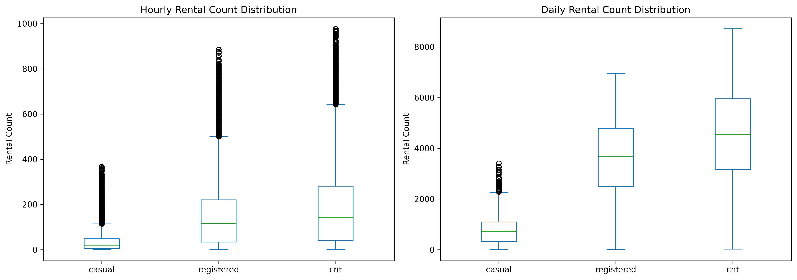

Rental-count distributions were right-skewed and contained IQR-based upper-tail outliers. In the hourly data, outliers represented 6.86% of casual, 3.91% of registered, and 2.91% of total-rental observations. In the daily data, outliers were detected only for casual rentals, representing 6.02% of observations. Inspection indicated that these records reflected plausible periods of unusually high demand rather than evident data errors, so they were retained.

#### Conclusion

The datasets demonstrated strong overall structural and logical consistency. The main data-quality considerations were `dteday` being stored as a string, 165 missing hourly observations (0.94%), and the presence of plausible outliers.

### Data Cleaning

Because the assessment identified no duplicate rows, invalid rental totals, explicit null values, or clearly erroneous outliers, extensive corrective cleaning was unnecessary.

Two preprocessing steps were applied to both datasets:

- Date conversion: `dteday` was converted from a string to a datetime data type to support calendar-based validation, grouping, and feature derivation.
- Chronological sorting: the hourly dataset was sorted by `dteday` and `hr`, while the daily dataset was sorted by `dteday`, both indexes were then reset.

No observations were removed solely because they were statistical outliers, and the 165 absent date-hour combinations were not imputed.

### Feature Engineering

Feature engineering focused on improving the interpretability of encoded temporal variables used in the analysis. The original encoded variables were retained for source fidelity, while readable labels were added for analysis and reporting. The assessment identified `yr` and `workingday` as analysis-relevant variables whose numerical codes were not immediately interpretable.

The following features were created in both datasets:

| Feature    | Derivation                                                      | Purpose                                                            |
| ---------- | --------------------------------------------------------------- | ------------------------------------------------------------------ |
| `year`     | Maps `yr = 0` to 2011 and `yr = 1` to 2012                      | Provides directly interpretable year labels                        |
| `day_type` | Maps `workingday = 1` to Working Day and `0` to Non-Working Day | Supports comparison of demand between working and non-working days |

## Exploratory Analysis

### Dataset Overview

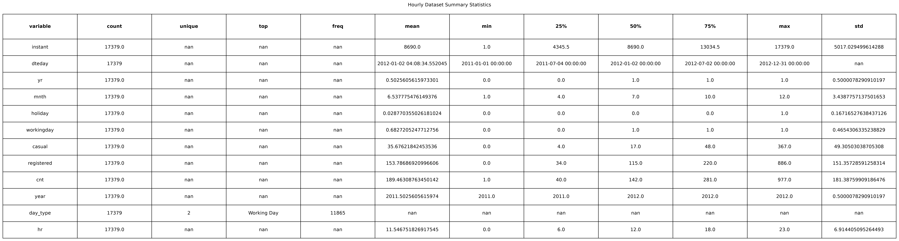

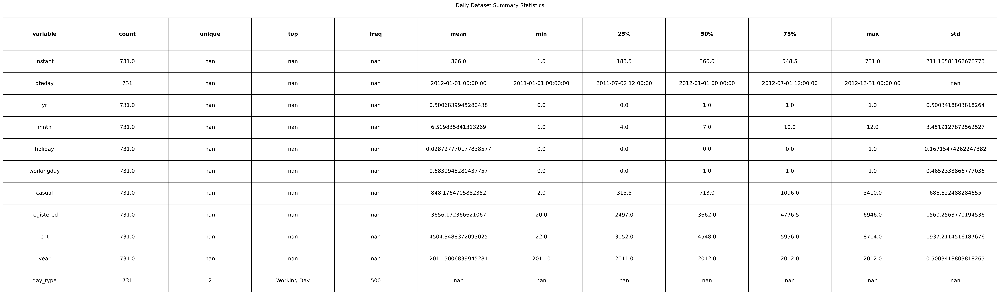

The dataset spans from January 1, 2011, to December 31, 2012, comprising 500 working days, 231 non-working days, and 17,379 hours. Over this two-year period, the average number of daily rentals was approximately 4,504, with registered rentals accounting for approximately 3,656 and casual rentals for approximately 848.

### Question 1: Changes in Bike-Sharing Demand Volume and User Composition

#### Key Findings

##### 1. Total rental demand increased substantially between 2011 and 2012

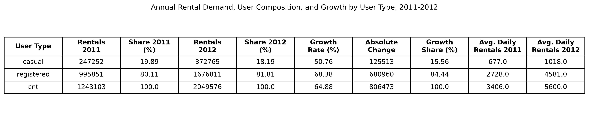

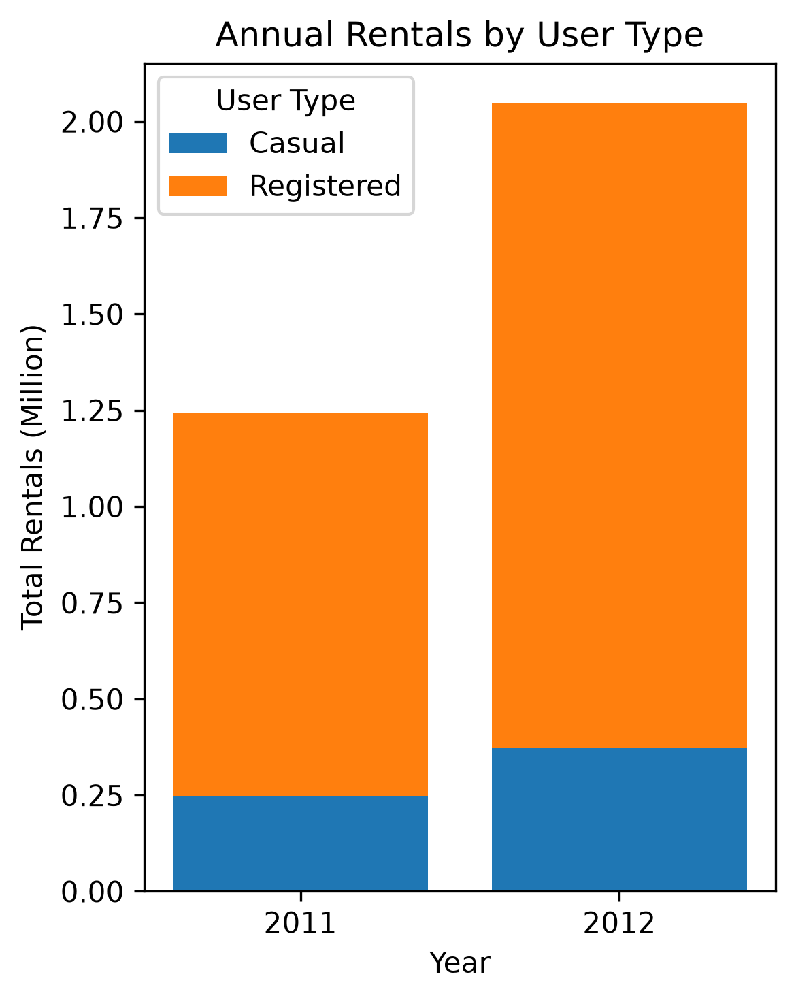

Annual rentals rose from 1,243,103 to 2,049,576, an increase of 806,473 rentals, or 64.88%. Average daily rentals likewise increased from approximately 3,406 to 5,600.

##### 2. Registered users remained the dominant source of demand and grew faster than casual users

Registered rentals increased from 995,851 to 1,676,811, representing 68.38% growth, compared with 50.76% growth for casual rentals, which increased from 247,252 to 372,765.

##### 3. Demand composition shifted modestly toward registered users

Registered users' share of total rentals increased from 80.11% to 81.81%, a gain of 1.70 percentage points. Correspondingly, the casual-user share declined from 19.89% to 18.19%.

##### 4. Most of the absolute growth came from registered rentals

Registered demand added 680,960 rentals, accounting for about 84.44% of the total increase, whereas casual demand added 125,513 rentals. Thus, growth occurred in both segments, but the expansion was disproportionately concentrated among registered users.

##### 5. The increase in demand was broad-based across the calendar rather than confined to a few months

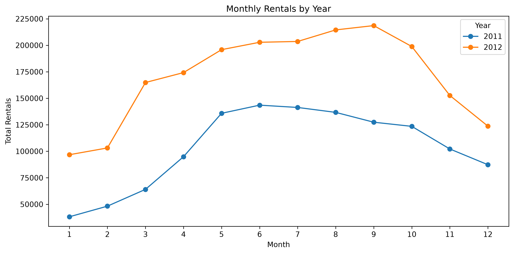

Rental volume in 2012 exceeded 2011 in every corresponding month, indicating sustained year-over-year expansion throughout the year.

#### Additional Observations

A clear seasonal pattern remained visible in both years. Demand was lower during the winter months, increased markedly through spring, remained elevated during the warmer months, and declined toward the end of the year. The higher 2012 trajectory therefore reflects growth layered onto an enduring seasonal demand cycle rather than the disappearance of seasonality.

Moreover, although rental volume increased year over year in every corresponding month and remained concentrated during the warmer months, the timing of peak demand shifted from June in 2011 (143,512 rentals) to September in 2012 (218,573 rentals), a 71.54% increase from September 2011. The broader seasonal pattern remained intact.

### Question 2: Changes in Hourly Bike-Sharing Demand Patterns

#### Key Findings

##### 1. Observed hourly rental demand was higher in 2012 than in 2011 at every hour of the day

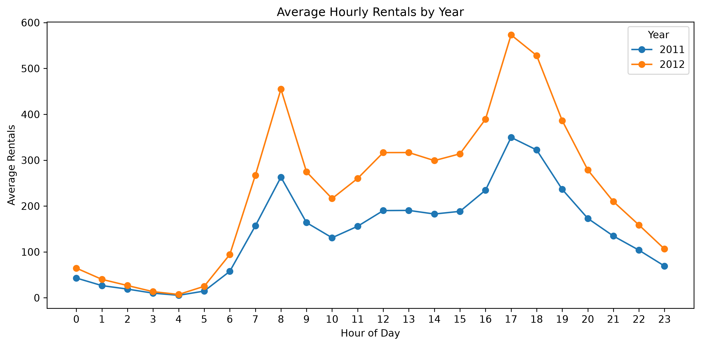

Despite the increase in scale, the overall daily profile remained broadly similar: very low overnight demand, a sharp morning rise, elevated daytime activity, and the strongest demand in the late afternoon.

##### 2. The system-wide peak remained at 5:00 PM in both years

Average rentals at that hour increased from approximately 350 in 2011 to 573 in 2012, an increase of roughly 64%. This indicates substantial growth without a corresponding shift in the principal peak hour.

##### 3. Registered users drove the pronounced morning and evening peaks

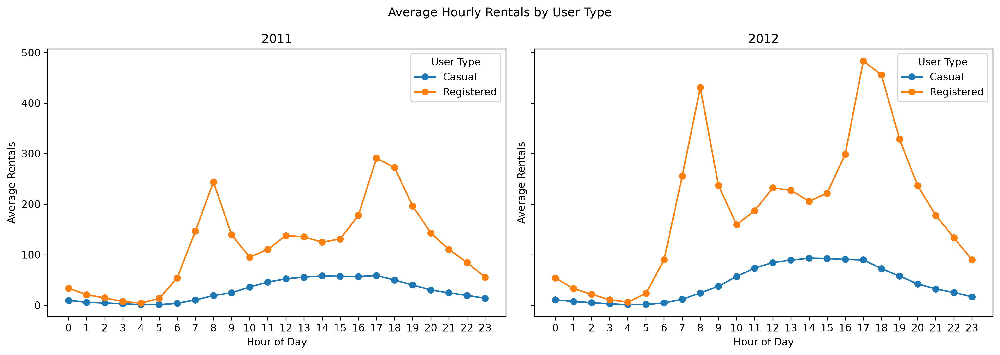

Their demand surged around 8:00 AM and again around 5:00–6:00 PM, producing a distinctly commute-oriented pattern. In 2012, registered rentals averaged approximately 431 at 8:00 AM and 484 at 5:00 PM, compared with about 244 and 291, respectively, in 2011.

##### 4. Casual-user demand followed a much smoother daytime pattern

Rather than exhibiting sharp commute peaks, casual rentals generally increased through the morning, remained elevated from midday into the afternoon, and then declined into the evening. The pattern became substantially larger in 2012, particularly during the afternoon, while remaining much flatter than the registered-user profile.

##### 5. Working and non-working days exhibited fundamentally different hourly demand shapes

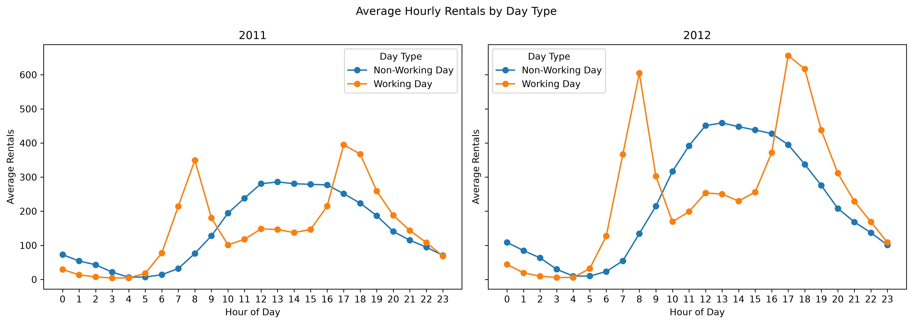

Working days showed two sharp peaks, around 8:00 AM and 5:00–6:00 PM, with markedly lower demand between them. Non-working days instead displayed a broad, gradual rise toward midday and early afternoon, followed by a gradual decline.

##### 6. The timing of these day-type peaks remained highly stable as demand expanded

On working days, the highest average occurred at 5:00 PM in both years, increasing from approximately 395 to 656 rentals. On non-working days, demand peaked around 1:00 PM, increasing from approximately 286 to 459 rentals. The principal change was therefore the magnitude of demand rather than a major displacement of peak periods.

##### 7. Registered users were the main source of working-day peaks

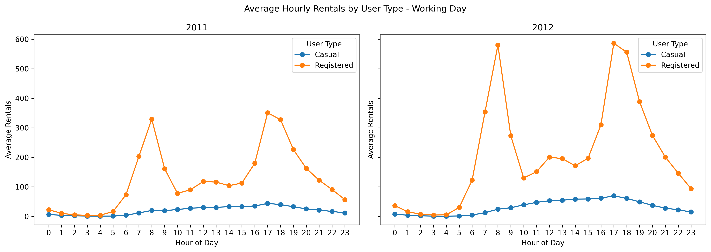

In 2012, registered rentals averaged approximately 580 at 8:00 AM and 586 at 5:00 PM, while casual rentals at those same times averaged only about 24 and 70. This makes the commute-shaped working-day pattern overwhelmingly associated with registered demand.

##### 8. Non-working-day demand was more broadly distributed across the day for both user types

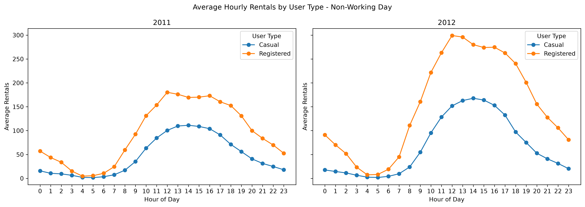

Casual rentals rose strongly from late morning through the afternoon, while registered users also displayed a broad daytime plateau rather than the sharp commute peaks observed on working days. Registered demand nevertheless remained higher than casual demand throughout the day.

### Conclusion

Capital Bikeshare experienced **substantial demand growth from 2011 to 2012**, while the overall structure of that demand remained remarkably consistent. Total annual rentals increased by **64.88%**, rising from **1.24 million to 2.05 million**. Both casual and registered rentals increased, but growth was stronger among registered users, whose share of total demand rose from **80.11% to 81.81%**. This indicates that system expansion was broad-based but increasingly concentrated among registered riders. Demand was also higher in 2012 in every corresponding month.

Hourly patterns reinforce the same conclusion: **2012 brought greater demand intensity rather than a fundamental change in when or how the system was used**. The overall peak remained at **5:00 PM** in both years, increasing from roughly **350 to 573 average rentals per hour**. Registered users continued to produce pronounced morning and evening peaks, particularly on working days, whereas casual users followed a smoother daytime profile. Non-working days retained a broad midday-to-afternoon pattern rather than the sharper commute-oriented peaks observed on working days.

These findings show that **Capital Bikeshare grew considerably in scale between 2011 and 2012 without materially altering its core demand structure**. Registered riders became slightly more dominant, and the magnitude of hourly demand increased across the day, but the principal user-type and working-versus-non-working-day patterns remained stable. In short, the system expanded around an already-established pattern of use rather than transitioning to a fundamentally different demand profile.

## Business Recommendations

- **Prioritize working-day commute peaks.** Concentrate bike redistribution, dock monitoring, and staffing before the strongest demand periods around 8:00 AM and 5:00–6:00 PM. In 2012, working-day demand peaked at about 656 rentals at 5:00 PM, with similarly high demand of 605 rentals at 8:00 AM and 617 rentals at 6:00 PM.

- **Protect service reliability for registered users.** Registered riders accounted for 81.81% of total rentals in 2012 and grew by 68.38%, faster than casual riders. Because they also dominate working-day commute peaks, operational planning should give particular attention to bike and dock availability during these periods.

- **Target casual-user activity during midday and non-working days.** Casual demand follows a smoother daytime pattern and is strongest from late morning through the afternoon, especially on non-working days. In 2012, rentals increased substantially from 10:00 AM to 6:00 PM, peaking at approximately 163–168 rentals between 1:00 PM and 3:00 PM. Customer-facing initiatives for casual riders should therefore be timed around these periods rather than commute hours.

- **Use separate operating plans for working and non-working days.** Working days require concentrated resources around sharp morning and evening peaks, whereas non-working days require broader coverage across midday and the afternoon. In 2012, non-working-day demand peaked at roughly 459 rentals at 1:00 PM.

- **Scale capacity around established peak periods.** Total rentals increased by 64.88%, from approximately 1.24 million in 2011 to 2.05 million in 2012, while the overall peak remained at 5:00 PM in both years. This suggests that near-term planning should focus on increasing capacity during already established high-demand periods rather than assuming that demand has shifted to entirely new times.

- **Incorporate seasonality into resource planning.** Demand is consistently stronger during warmer months and weaker during winter. Staffing, maintenance, rebalancing, and fleet readiness should therefore be adjusted across the year, with greater operational preparedness before higher-demand months.

## Limitations

- **Descriptive scope:** The analysis identifies patterns and changes but does not establish causality.
- **Scope of analysis:** The analysis focuses on demand changes by user type, hour, and working vs. non-working day. More granular weekday/holiday differences, monthly variations in hourly demand, and environmental factors such as weather were outside the analytical scope.
- **Short time horizon:** Findings cover only 2011–2012, limiting longer-term generalization.
- **Incomplete hourly coverage:** 165 hourly records (0.94%) are missing, with uneven distribution across years, day types, and hours.
- **Aggregated demand:** Rental counts do not represent unique users, so individual riding frequency cannot be assessed.
- **No station-level analysis:** The data support temporal analysis but do not provide station-level detail, so the analysis can identify when demand is concentrated, but not where station-specific pressure occurs.

## Technology

- **Python:** Primary programming language used for the analysis.

- **Jupyter Notebook:** Used to organize, execute, and document the analysis interactively.

- **Visual Studio Code:** Used as the IDE for running and managing the notebook.

- **Pandas:** Used for loading CSV files, manipulating DataFrames, grouping and aggregating data, computing descriptive statistics, performing consistency checks, and transforming variables.

- **Matplotlib:** Used for visualization.

- **KaggleHub:** Used to programmatically download the dataset.

- **DataFrame Viewer**: Used to inspect tabular data in a DataFrame.

## Author and License

The original code and documentation for this project are licensed under the [MIT License](LICENSE).

The Bike Sharing dataset was created by Hadi Fanaee-T and is distributed through the [UCI Machine Learning Repository](https://doi.org/10.24432/C5W894). The dataset is not original work of this project and remains subject to the terms, attribution requirements, and other conditions applicable to the dataset and its original distribution.

Cover image by [Slidesgo](https://slidesgo.com/theme/eco-city-sustainable-future), with icons by Flaticon and infographics and images by Freepik.

For questions or feedback:

- **Email:** [ariefzuhri@outlook.co.id](mailto:ariefzuhri@outlook.co.id) (Arief Zuhri)

- **LinkedIn:** [linkedin.com/in/ariefzuhri](https://www.linkedin.com/in/ariefzuhri)

- **GitHub:** [Open an issue](https://github.com/ariefzuhri/bikeshare-demand-shifts/issues)

## References

- **Fanaee-T, H. (2013).** *Bike Sharing* [Dataset]. UCI Machine Learning Repository. https://doi.org/10.24432/C5W894
- **Fanaee-T, H., & Gama, J. (2013).** Event labeling combining ensemble detectors and background knowledge. *Progress in Artificial Intelligence, 2*(2–3), 113–127. https://doi.org/10.1007/s13748-013-0040-3
